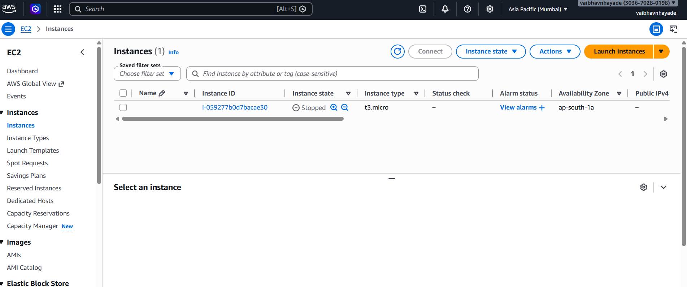
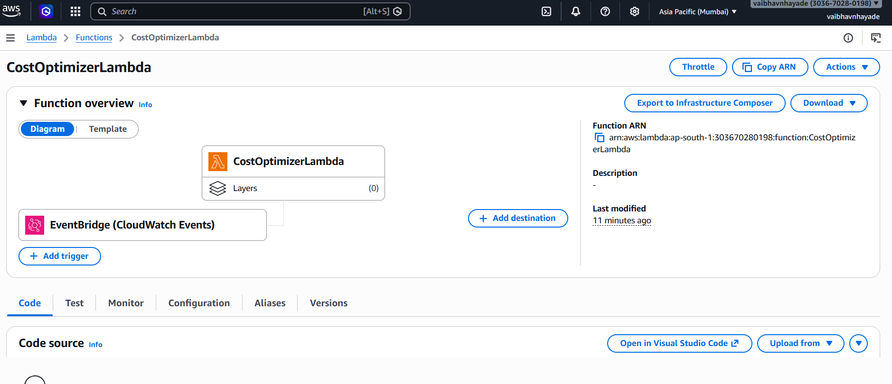
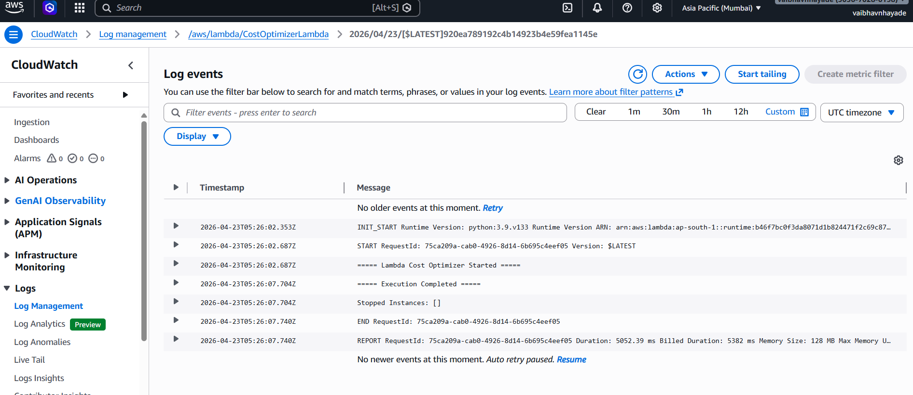

# 🚀 AWS Cost Optimizer

## 📌 Overview

This project automatically reduces AWS costs by stopping EC2 instances that are not actively used.
It uses Python (Boto3) along with AWS services like Lambda, CloudWatch, and EventBridge.

---

## ⚙️ How It Works

* EC2 instance runs normally
* CloudWatch collects CPU usage data
* Lambda function checks CPU utilization
* If CPU usage is below threshold → instance is stopped
* EventBridge triggers this process every 10 minutes

---

## 🧰 Technologies Used

* Python (Boto3)
* AWS Lambda
* Amazon EC2
* Amazon CloudWatch
* Amazon EventBridge

---

## 📁 Project Structure

```bash
aws-cost-optimizer/
│
├── lambda/
│   ├── lambda_function.py
│   └── function.zip
│
├── script/
│   ├── deploy.py
│   └── create_ec2.py
│
├── screenshots/
│   ├── ec2.png
│   ├── lambda.png
│   └── logs.png
│
└── README.md
```

---

## ▶️ Steps to Run

```bash
# 1. Create EC2 instance
python create_ec2.py

# 2. Zip Lambda file
cd lambda
Compress-Archive -Path lambda_function.py -DestinationPath function.zip

# 3. Deploy project
cd ../script
python deploy.py
```

---

## 📸 Screenshots

### EC2 Instance



### Lambda Function



### CloudWatch Logs (Output)



---

## 📍 Output

Logs can be viewed in CloudWatch:

```
/aws/lambda/CostOptimizerLambda
```

Example:

```
Checking instance: i-123456
CPU Utilization: 2.1%
Stopped instance: i-123456
```

---

## ⚠️ Important Notes

* Use **t3.micro** instance (Free Tier)
* Add tag to EC2:

```
AutoStop = true
```

* Wait a few minutes for CloudWatch metrics

---

## 💡 Summary

This project demonstrates how AWS services can be automated to manage resources efficiently and reduce unnecessary cloud costs.

---

## 👨‍💻 Author

Vaibhav Nhayade
# CapstoneProject
